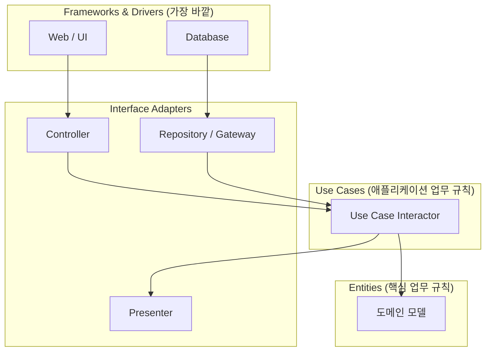
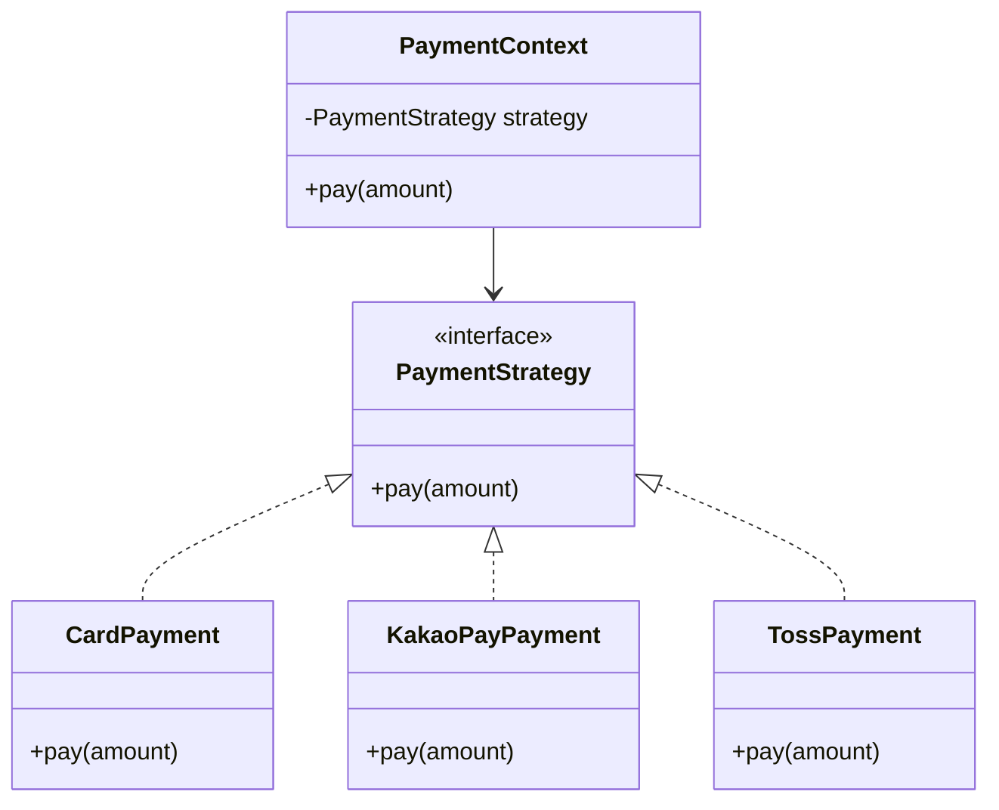

# Clean Architecture와 디자인 패턴: 지속 가능한 코드 설계

프로그램은 만드는 것보다 유지보수하는 것이 훨씬 어렵습니다. **클린 아키텍처(Clean Architecture)**와 **디자인 패턴**은 시간이 지나도 코드가 썩지 않고, 요구사항 변경에 유연하게 대처할 수 있는 구조를 제안합니다.

---

## 1. 클린 아키텍처 (Clean Architecture)

로버트 C. 마틴이 제안한 이 설계의 핵심은 **"관심사의 분리"**와 **"의존성의 방향"**입니다.

*   **의존성 규칙:** 의존성은 반드시 안쪽(비즈니스 로직)으로만 향해야 합니다.
*   **Entities (핵심 업무 규칙):** 가장 안쪽 원. 데이터베이스나 프레임워크가 바뀌어도 절대 변하지 않는 핵심 비즈니스 모델입니다.
*   **Use Cases (애플리케이션 업무 규칙):** 시스템의 동작을 정의합니다.
*   **Adapters & Frameworks:** 가장 바깥쪽 원. DB, 웹 프레임워크, UI 등은 언제든 교체 가능한 세부 사항으로 취급합니다.

계층 구조와 의존성의 방향을 그림으로 나타내면 다음과 같습니다.



의존성 화살표가 항상 안쪽(Entities)을 향하고, 바깥쪽 원(DB, 웹 프레임워크)은 안쪽을 알지 못한다는 점이 핵심입니다.

---

## 2. 실무에서 자주 쓰이는 디자인 패턴

디자인 패턴은 선배 개발자들이 마주했던 문제들에 대한 **검증된 해결책**입니다.

### **① 싱글톤 패턴 (Singleton)**
클래스의 인스턴스를 하나만 생성하여 애플리케이션 전역에서 공유합니다. 스프링의 빈(Bean)이 기본적으로 이 방식으로 관리됩니다.

### **② 전략 패턴 (Strategy)**
알고리즘을 클래스화하여 필요에 따라 동적으로 교체합니다. 예를 들어, 결제 수단(카드, 카카오페이, 토스)에 따라 다른 결제 로직을 실행할 때 유용합니다.



```java
interface PaymentStrategy {
    void pay(int amount);
}

class KakaoPayPayment implements PaymentStrategy {
    public void pay(int amount) { /* 카카오페이 결제 로직 */ }
}

// 실행 시점에 전략(결제 수단)만 바꿔 끼우면 된다
PaymentContext context = new PaymentContext(new KakaoPayPayment());
context.pay(10000);
```

### **③ 빌더 패턴 (Builder)**
복잡한 객체 생성 과정을 캡슐화합니다. 가독성이 높고 필요한 필드만 선택적으로 설정할 수 있어 자바 개발자에게 필수적인 패턴입니다. (Lombok의 `@Builder`)

```java
@Builder
public class Order {
    private final String productName;
    private final int quantity;
    private final String memo; // 선택 필드
}

Order order = Order.builder()
    .productName("키보드")
    .quantity(1)
    .build(); // memo는 생략 가능
```

---

## 3. 왜 이런 구조를 고민해야 할까?

1.  **테스트 용이성:** 비즈니스 로직이 외부 프레임워크(DB 등)와 분리되어 있어 테스트하기 쉽습니다.
2.  **유연성:** MySQL을 쓰다가 PostgreSQL로 바꿔도 핵심 로직은 수정할 필요가 없습니다.
3.  **협업 효율:** 규칙이 명확하므로 수십 명의 개발자가 작업해도 코드의 일관성이 유지됩니다.

---

## 4. 결론

처음부터 완벽한 클린 아키텍처를 적용하는 것은 오버엔지니어링이 될 수 있습니다. 하지만 **"비즈니스 로직은 기술적 세부사항에 의존하지 않는다"**는 원칙을 가슴에 새기고 코드를 작성한다면, 훨씬 더 나은 품질의 소프트웨어를 만들 수 있을 것입니다.
