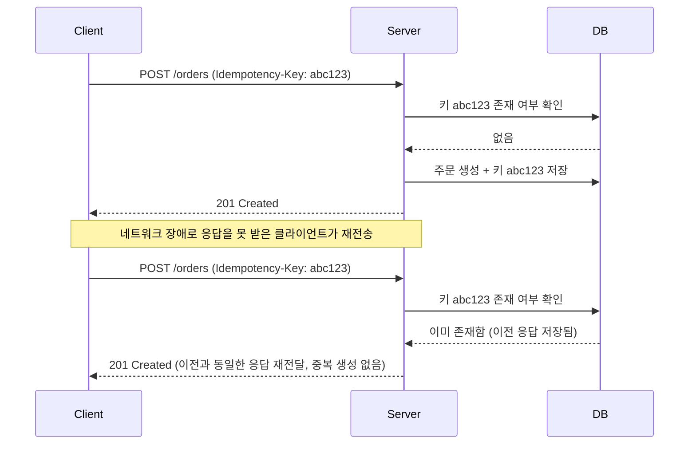
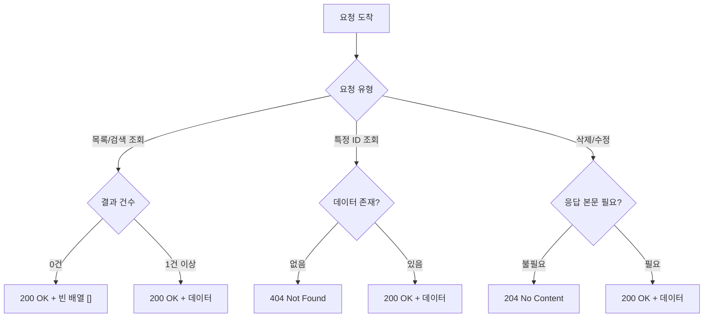

# REST API 설계 가이드: HTTP 메서드와 상태 코드 (GET, POST, PUT, PATCH, DELETE)

현대 웹 아키텍처에서 **REST(Representational State Transfer)**는 가장 널리 쓰이는 API 설계 방식입니다. RESTful한 API를 만든다는 것은 단순히 URL을 만드는 것을 넘어, **HTTP 표준 메서드**와 **상태 코드**를 목적에 맞게 사용하는 것을 의미합니다. 2026년 기준 최신 실무 가이드를 정리합니다.

---

## 1. HTTP 메서드(Verbs)와 멱등성(Idempotency)

가장 흔히 하는 실수는 모든 수정을 `POST`로 처리하거나, 수정 시 `PUT`과 `PATCH`를 혼용하는 것입니다. 이를 구분하는 핵심 개념은 **'멱등성'**입니다.

> **멱등성(Idempotency):** 동일한 요청을 여러 번 보내도 서버의 상태가 처음 한 번 보냈을 때와 같은 성질.

| 메서드 | 역할 (CRUD) | 멱등성 | 설명 |
| :--- | :--- | :--- | :--- |
| **GET** | 조회 (Read) | **Yes** | 데이터를 가져올 뿐, 서버 상태를 변경하지 않음 (Safe) |
| **POST** | 생성 (Create) | **No** | 리소스를 새로 만듦. 여러 번 호출하면 여러 개가 생길 수 있음 |
| **PUT** | 교체 (Replace) | **Yes** | 리소스 전체를 새 데이터로 덮어씀. 결과가 항상 일정함 |
| **PATCH** | 수정 (Update) | **No*** | 리소스의 일부만 수정함. (일반적으로 멱등하게 설계하나 표준은 아님) |
| **DELETE** | 삭제 (Delete) | **Yes** | 리소스를 삭제함. 이미 삭제된 리소스에 또 보내도 결과(삭제됨)는 같음 |

---

## 2. 실무에서 헷갈리는 PUT vs PATCH

*   **PUT:** "이 ID의 데이터를 내가 보내는 것으로 **통째로 바꿔줘**." 만약 특정 필드를 누락하고 보내면, 그 필드는 `null`이 되거나 기본값으로 덮어씌워질 위험이 있습니다.
*   **PATCH:** "이 ID의 데이터 중 **이 필드들만 고쳐줘**." 변경하고 싶은 부분만 보내므로 데이터 효율성이 높고 실수를 줄일 수 있습니다.

---

## 3. 상황별 HTTP 상태 코드 (Status Codes)

클라이언트는 상태 코드를 보고 요청의 성공 여부를 판단합니다. 단순히 `200`이나 `500`만 쓰는 것이 아니라, 의미에 맞는 코드를 반환해야 합니다.

### **2xx: 성공 (Success)**
*   **200 OK:** 조회, 수정, 삭제 성공.
*   **201 Created:** 생성(`POST`) 성공. 헤더에 생성된 리소스의 위치(Location)를 포함하는 것이 관례입니다.
*   **204 No Content:** 성공했지만 응답 본문에 보낼 내용이 없음 (주로 `DELETE` 후 사용).

### **4xx: 클라이언트 오류 (Client Error)**
*   **400 Bad Request:** 잘못된 파라미터나 형식으로 요청했을 때.
*   **401 Unauthorized:** 로그인이 필요한데 하지 않았을 때.
*   **403 Forbidden:** 로그인은 했지만 해당 리소스에 접근할 권한이 없을 때.
*   **404 Not Found:** 존재하지 않는 URL이거나 리소스일 때.
*   **429 Too Many Requests:** 너무 짧은 시간 동안 많은 요청을 보냈을 때 (Rate Limiting).

### **5xx: 서버 오류 (Server Error)**
*   **500 Internal Server Error:** 서버 코드 로직 오류.
*   **503 Service Unavailable:** 점검 중이거나 과부하로 서버가 일시적으로 중단됨.

---

## 4. 2026년 기준 REST API 설계 Best Practices

1. **명사형 URI 사용:** `/getUsers` (X) → `/users` (O). 행위는 HTTP 메서드로 표현합니다.
2. **계층 관계 표현:** `/users/1/orders` (사용자 1의 주문 목록).
3. **복수형 사용:** `/user/1` (X) → `/users/1` (O). 컬렉션 단위로 생각하는 것이 관례입니다.
4. **버전 관리:** `/v1/users`. API 스펙 변경에 대비하여 경로에 버전을 포함합니다.
5. **JSON 표준 준수:** 항상 `Content-Type: application/json`을 유지합니다.
6. **멱등성 키(Idempotency Key):** 네트워크 장애로 `POST` 요청이 중복 전달되는 것을 막기 위해, 헤더에 고유 키를 넣어 중복 생성을 방지하는 기법(Stripe 방식)이 많이 쓰입니다. 예를 들어 클라이언트는 `Idempotency-Key: 5f3e...` 헤더를 함께 보내고, 서버는 동일한 키로 재요청이 오면 실제 로직을 다시 실행하지 않고 이전 응답을 그대로 반환합니다.

**멱등성 키를 이용한 중복 요청 방지 흐름**

### **5. 데이터가 없을 때의 상태 코드 처리 (Q&A)**

API 호출은 성공했으나 데이터가 없는 경우, 상황에 따라 적절한 코드를 선택해야 합니다.

| 요청 상황 | 추천 코드 | 응답 본문(Body) | 비고 |
| :--- | :--- | :--- | :--- |
| **목록/검색 조회** (결과 0건) | **200 OK** | `[]` (빈 배열) | "검색 결과가 없음"도 하나의 유효한 결과로 간주합니다. |
| **특정 ID 조회** (데이터 없음) | **404 Not Found** | 에러 메시지 객체 | 해당 URI에 자원이 존재하지 않음을 명시합니다. |
| **삭제/수정 성공** (응답 데이터 불필요) | **204 No Content** | (없음) | 성공은 했으나 전달할 본문이 없을 때 사용합니다. |

*   **Tip:** `204 No Content`를 검색 결과가 없을 때 사용하기도 하지만, 클라이언트 개발자가 `null` 체크나 빈 배열 체크를 하는 것이 더 일반적이므로 검색은 `200` + `[]`를 권장합니다.

**요청 유형별 상태 코드 결정 흐름**

### **결론**
좋은 API는 설명서 없이도 그 형태와 응답 코드만으로 기능을 짐작할 수 있는 API입니다. 표준을 준수하는 것이 곧 최고의 문서화입니다.
