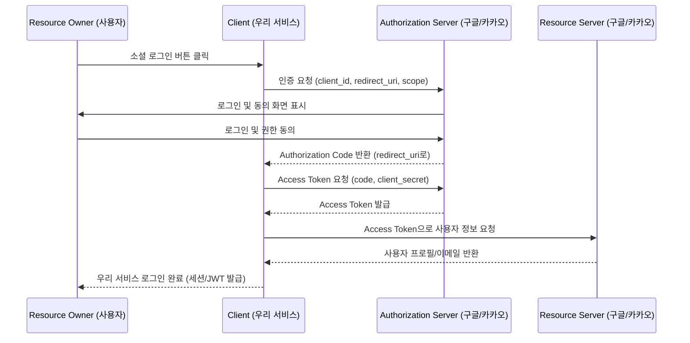

# OAuth 2.0 소셜 로그인 연동하기: 구글, 카카오로 시작하는 간편 인증


복잡한 회원가입 절차는 사용자 이탈의 주된 원인입니다. **OAuth 2.0**을 이용하면 사용자가 이미 가입한 구글, 카카오, 네이버 계정을 통해 안전하고 빠르게 우리 서비스에 로그인하게 할 수 있습니다.

---

## 1. OAuth 2.0의 핵심 역할자

*   **Resource Owner:** 일반 사용자 (나).
*   **Client:** 우리 서비스 (애플리케이션).
*   **Resource Server:** 구글, 카카오 등 정보를 가진 서버.
*   **Authorization Server:** 인증을 담당하고 Access Token을 발급하는 서버.

각 역할자가 어떻게 상호작용하는지 인가 코드(Authorization Code) 방식의 흐름으로 살펴보면 다음과 같습니다.



---

## 2. Spring Boot OAuth2 Client 설정

스프링 부트는 `spring-boot-starter-oauth2-client`를 통해 매우 쉬운 연동을 지원합니다.

### **① 의존성 추가**
```xml
<dependency>
    <groupId>org.springframework.boot</groupId>
    <artifactId>spring-boot-starter-oauth2-client</artifactId>
</dependency>
```

### **② 설정 (application.yml)**
구글 개발자 콘솔(Google Cloud Console)의 'API 및 서비스 > 사용자 인증 정보'에서 OAuth 클라이언트 ID를 생성하고, 발급받은 ID와 Secret을 입력합니다.

<!-- TODO: 실제 스크린샷 추가 필요 (예: 구글 클라우드 콘솔 OAuth 클라이언트 ID 발급 화면) -->

```yaml
spring:
  security:
    oauth2:
      client:
        registration:
          google:
            client-id: YOUR_CLIENT_ID
            client-secret: YOUR_CLIENT_SECRET
            scope:
              - email
              - profile
```

---

## 3. 구현 방식 (CustomOAuth2UserService)

로그인 성공 후 사용자 정보를 우리 DB에 저장하거나 추가 로직을 실행하기 위해 서비스를 커스텀합니다.

```java
@Service
public class CustomOAuth2UserService implements OAuth2UserService<OAuth2UserRequest, OAuth2User> {
    @Override
    public OAuth2User loadUser(OAuth2UserRequest userRequest) {
        // 1. 구글/카카오로부터 유저 정보 가져오기
        // 2. 우리 서비스 DB에 없으면 자동 가입 처리
        // 3. 권한 부여 후 유저 객체 반환
    }
}
```

`loadUser()` 내부의 판단 로직을 순서도로 표현하면 다음과 같습니다.

```mermaid
flowchart TD
    A[loadUser 호출] --> B[구글/카카오로부터 사용자 정보 조회]
    B --> C{우리 DB에 동일 이메일 존재?}
    C -- 아니오 --> D[신규 회원으로 자동 가입 처리]
    C -- 예 --> E[기존 회원 정보 업데이트]
    D --> F[권한(ROLE) 부여]
    E --> F
    F --> G[OAuth2User 객체 반환]
```

---

## 4. 왜 OAuth 2.0인가?

1.  **보안성:** 우리 서비스가 사용자의 비밀번호를 직접 알 필요가 없습니다.
2.  **신뢰도:** 대형 플랫폼의 인증을 빌려 쓰므로 사용자에게 신뢰를 줍니다.
3.  **마케팅 활용:** 동의하에 이메일 등의 정보를 받아 마케팅에 활용할 수 있습니다.

---

## 5. 결론

소셜 로그인은 이제 선택이 아닌 필수 기능입니다. Spring Security와 OAuth2 Client 라이브러리를 활용하면 복잡한 프로토콜 이해 없이도 강력한 인증 시스템을 구축할 수 있습니다.
