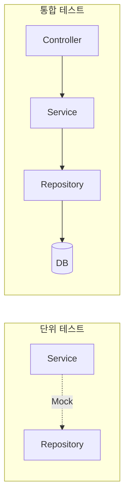
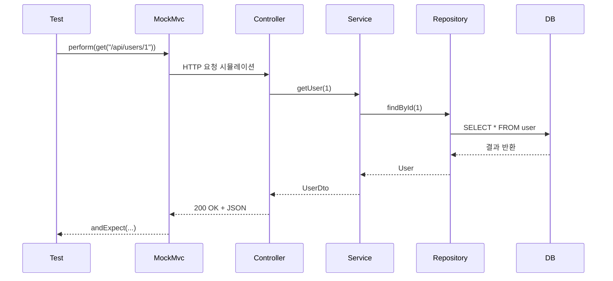

# Spring Boot 테스트 코드 작성하기: JUnit 5와 Mockito 활용 가이드


견고한 애플리케이션의 핵심은 **테스트 코드**입니다. 단순히 "코드가 돌아가는 것"을 넘어, 의도한 대로 동작함을 검증하고 리팩토링의 안전망을 구축하는 방법을 정리합니다. 2026년 기준 가장 많이 쓰이는 **JUnit 5**와 **Mockito**를 중심으로 살펴봅니다.

---

## 1. 테스트의 종류

*   **단위 테스트(Unit Test):** 하나의 메소드나 클래스를 독립적으로 테스트합니다. 외부 의존성(DB 등)은 가짜 객체(Mock)로 대체하여 매우 빠르게 실행됩니다.
*   **통합 테스트(Integration Test):** 스프링 컨테이너를 실제로 띄워 여러 컴포넌트 간의 상호작용을 테스트합니다. 실제 DB 연동까지 검증합니다.

두 테스트가 애플리케이션의 어느 계층까지 검증 범위에 포함하는지 비교하면 다음과 같습니다.



---

## 2. 단위 테스트 작성하기 (Mockito 활용)

서비스 레이어를 테스트할 때, 데이터베이스 접근 객체(Repository)를 가짜로 만들어 비즈니스 로직에만 집중합니다.

```java
@ExtendWith(MockitoExtension.class)
class UserServiceTest {

    @Mock
    private UserRepository userRepository;

    @InjectMocks
    private UserService userService;

    @Test
    @DisplayName("회원 가입 성공 테스트")
    void join_Success() {
        // given (준비)
        User user = new User("홍길동", "hong@test.com");
        given(userRepository.save(any())).willReturn(user);

        // when (실행)
        Long savedId = userService.join(user);

        // then (검증)
        assertThat(savedId).isNotNull();
        verify(userRepository, times(1)).save(any());
    }
}
```

---

## 3. 통합 테스트 작성하기 (@SpringBootTest)

API 컨트롤러부터 데이터베이스까지 전체 흐름을 테스트합니다. `MockMvc`가 실제 HTTP 요청을 흉내 내어 컨트롤러에 전달하고, 이후 서비스와 리포지토리를 거쳐 응답이 반환되는 과정은 다음과 같습니다.



```java
@SpringBootTest
@AutoConfigureMockMvc
@Transactional // 테스트 후 데이터 롤백
class UserApiTest {

    @Autowired
    private MockMvc mockMvc;

    @Test
    @DisplayName("API를 통한 사용자 조회 테스트")
    void getUser_ApiTest() throws Exception {
        mockMvc.perform(get("/api/users/1"))
                .andExpect(status().isOk())
                .andExpect(jsonPath("$.name").value("홍길동"));
    }
}
```

---

## 4. 좋은 테스트 코드를 위한 원칙 (F.I.R.S.T)

1.  **Fast (빠르게):** 테스트는 자주 실행되어야 하므로 빨라야 합니다.
2.  **Independent (독립적으로):** 각 테스트는 서로 의존하지 않고 단독으로 실행 가능해야 합니다.
3.  **Repeatable (반복 가능하게):** 어떤 환경에서도 결과가 항상 같아야 합니다.
4.  **Self-Validating (자가 검증):** 성공/실패 여부를 코드가 직접 알려줘야 합니다.
5.  **Timely (적시에):** 실제 코드를 구현하기 직전이나 직후에 작성해야 합니다.

---

## 5. 결론

테스트 코드는 작성할 때는 번거롭지만, 장기적으로는 버그 수정 비용을 획기적으로 낮춰줍니다. 특히 **TDD(테스트 주도 개발)**를 실천해보며 코드의 품질을 높여보세요!
