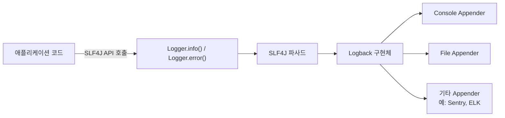
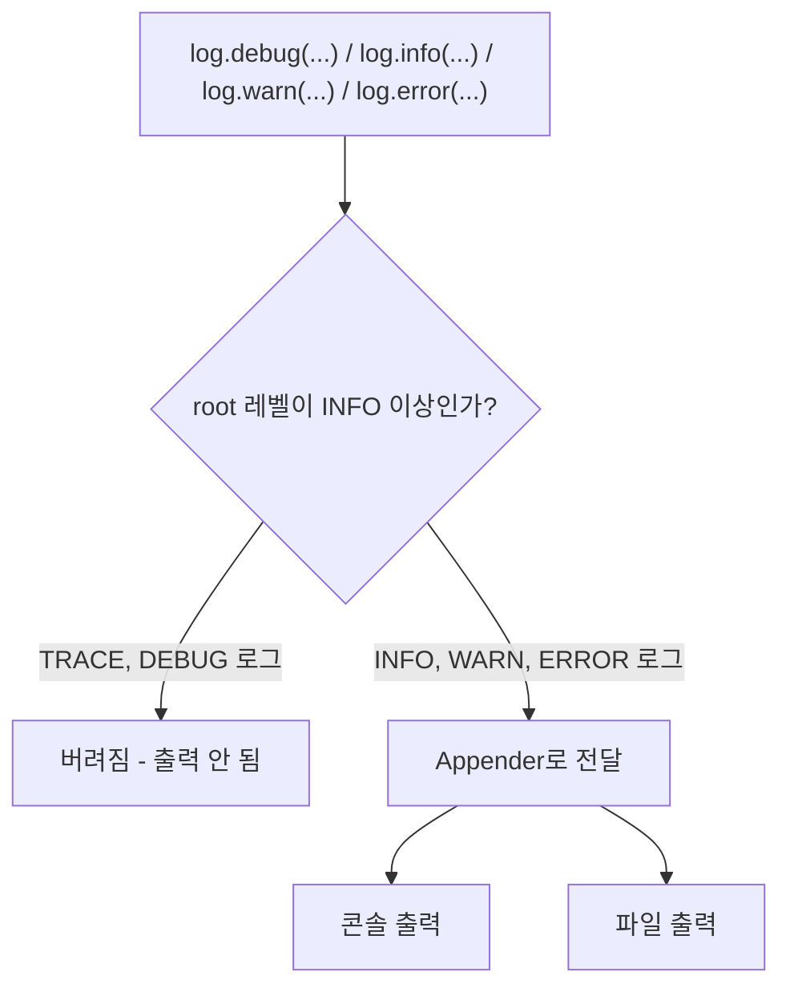

# 올바른 로깅 전략: SLF4J와 Logback으로 운영 환경 모니터링하기

`System.out.println()`은 개발 단계에서 편리하지만, 실제 서비스 운영 환경에서는 절대 사용해서는 안 됩니다. **로깅(Logging)**은 서버의 상태를 기록하고 장애 발생 시 원인을 파악하는 가장 강력한 무기입니다.

SLF4J(Simple Logging Facade for Java)는 로깅 API의 "인터페이스" 역할을 하고, Logback은 그 인터페이스를 실제로 구현하는 "엔진"입니다. 코드에서는 항상 SLF4J API(`Logger`, `LoggerFactory`)만 사용하고, 실제 출력 방식은 Logback 설정 파일이 담당하는 구조입니다.



이런 구조 덕분에 나중에 Logback을 Log4j2 같은 다른 구현체로 교체하더라도, 애플리케이션 코드는 전혀 수정할 필요가 없습니다.

---

## 1. 왜 로깅 라이브러리를 써야 할까?

1.  **성능:** 로그 출력 여부를 제어할 수 있어 성능 저하를 방지합니다.
2.  **파일 관리:** 로그를 파일로 저장하고, 날짜나 용량별로 자동으로 관리(Rolling)할 수 있습니다.
3.  **다양한 레벨:** 로그의 중요도에 따라 출력을 조절할 수 있습니다.

---

## 2. 로그 레벨 (Log Levels)

스프링 부트는 기본적으로 다음 5가지 레벨을 제공합니다. (오른쪽으로 갈수록 중요도가 높음)
`TRACE < DEBUG < INFO < WARN < ERROR`

*   **INFO:** 시스템 운영상의 일반적인 정보 (기본값).
*   **WARN:** 잠재적인 위험 상황. 당장 문제는 없지만 주의 깊게 봐야 할 때.
*   **ERROR:** 심각한 문제 발생. 즉각적인 조치가 필요한 상태.
*   **DEBUG:** 개발 단계에서 상세한 정보를 확인하고 싶을 때.

`root` 로거의 레벨을 `INFO`로 설정하면, 그보다 낮은 `TRACE`/`DEBUG` 로그는 출력되지 않고 `INFO` 이상만 Appender로 전달됩니다.



---

## 3. 실무 로깅 설정 (logback-spring.xml)

로그의 출력 형식을 지정하고, 매일매일 로그 파일을 새로 생성하도록 설정하는 예시입니다.

```xml
<configuration>
    <appender name="FILE" class="ch.qos.logback.core.rolling.RollingFileAppender">
        <file>logs/app.log</file>
        <rollingPolicy class="ch.qos.logback.core.rolling.TimeBasedRollingPolicy">
            <fileNamePattern>logs/app.%d{yyyy-MM-dd}.log</fileNamePattern>
            <maxHistory>30</maxHistory> <!-- 30일간 보관 -->
        </rollingPolicy>
        <encoder>
            <pattern>%d{yyyy-MM-dd HH:mm:ss} [%thread] %-5level %logger{36} - %msg%n</pattern>
        </encoder>
    </appender>

    <root level="INFO">
        <appender-ref ref="FILE" />
    </root>
</configuration>
```

---

## 4. 올바른 로그 작성 습관

1.  **의미 있는 정보 기록:** "에러 발생" 대신 "User ID [123] 결제 실패: 잔액 부족"처럼 구체적으로 적으세요.
2.  **데이터 암호화:** 개인정보(비밀번호, 카드번호 등)는 절대로 로그에 남기지 마세요.
3.  **적절한 레벨 선택:** 루프 안의 잦은 출력은 `DEBUG`, 중요한 비즈니스 흐름은 `INFO`를 사용하세요.
4.  **예외 스택 트레이스:** `log.error("에러 발생", e);` 처럼 예외 객체를 함께 넘겨 스택 정보를 남기세요.

---

## 5. 결론

로그는 **"미래의 나를 위한 메시지"**입니다. 서비스에 문제가 생겼을 때, 과거에 내가 정성껏 남긴 로그가 가장 먼저 길을 안내해 줄 것입니다.
