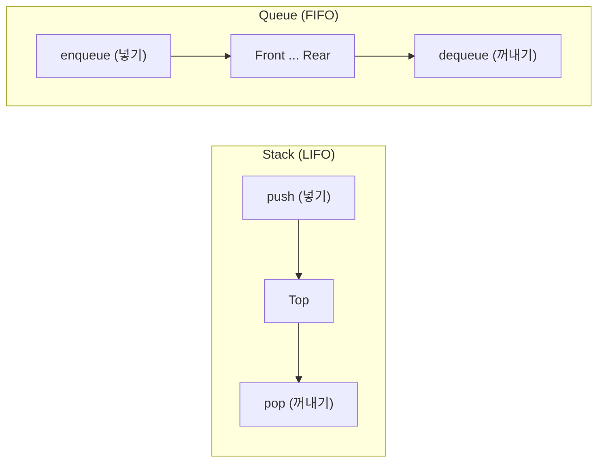
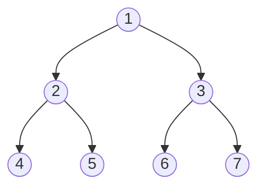
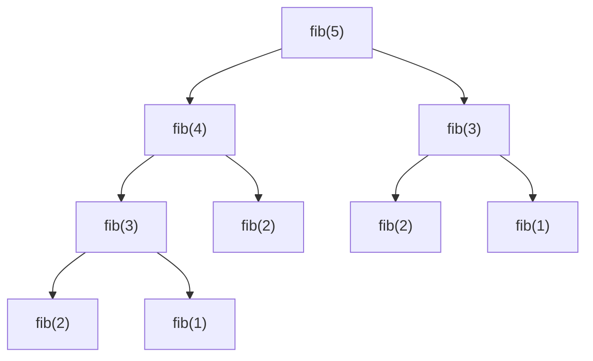

# 개발자 필수 자료구조 및 알고리즘: 코딩테스트를 위한 지도

좋은 개발자는 도구를 상황에 맞게 골라 쓸 줄 아는 사람입니다. 자료구조는 '데이터를 담는 그릇'이고, 알고리즘은 '문제를 푸는 방법'입니다. 코딩테스트와 실무에서 가장 중요한 핵심 개념들을 정리합니다.

---

## 1. 필수 자료구조 (Data Structures)

*   **Array(배열):** 데이터가 메모리에 연속적으로 저장됩니다. 인덱스로 빠르게 접근($O(1)$)할 수 있지만, 삽입/삭제는 느립니다.
*   **List(연결 리스트):** 노드들이 연결된 형태입니다. 삽입/삭제가 빠르지만 특정 위치를 찾으려면 처음부터 훑어야 합니다.
*   **Stack(스택):** LIFO(Last-In-First-Out, 후입선출). 되돌리기(Undo), 괄호 검사 등에 쓰입니다.
*   **Queue(큐):** FIFO(First-In-First-Out, 선입선출). 프린터 출력 대기열, BFS 탐색에 쓰입니다.
*   **Hash Table(해시):** Key-Value 쌍으로 저장합니다. 검색 속도가 압도적으로 빠릅니다($O(1)$).

**스택과 큐의 데이터 입출력 방향 비교**


---

## 2. 필수 알고리즘 (Algorithms)

### **① 정렬 (Sorting)**
데이터를 순서대로 나열합니다.
*   **Quick Sort / Merge Sort:** 평균적으로 가장 빠르고 널리 쓰입니다($O(N \log N)$).

### **② 탐색 (Search)**
*   **Binary Search(이진 탐색):** 정렬된 데이터에서 범위를 절반씩 줄여가며 찾습니다. 매우 빠릅니다($O(\log N)$).
*   **DFS(깊이 우선 탐색):** 스택이나 재귀를 사용하여 깊게 파고드는 탐색.
*   **BFS(너비 우선 탐색):** 큐를 사용하여 인접한 노드부터 넓게 퍼져나가는 탐색. (최단 거리 찾기에 유리)

**같은 트리에서 DFS와 BFS의 방문 순서 차이**

위 트리를 기준으로 DFS는 `1 → 2 → 4 → 5 → 3 → 6 → 7` 순서로 한쪽 가지를 끝까지 파고든 뒤 돌아오고, BFS는 `1 → 2 → 3 → 4 → 5 → 6 → 7` 순서로 같은 깊이(레벨)를 먼저 모두 방문합니다.

### **③ 동적 계획법 (DP, Dynamic Programming)**
*   큰 문제를 작은 문제로 나누어 풀고, 결과를 저장(Memoization)하여 중복 계산을 피하는 영리한 방법입니다.

예를 들어 피보나치 수열을 재귀로만 풀면 `fib(2)`, `fib(3)` 같은 값이 여러 번 반복 계산됩니다.

**메모이제이션 없이 fib(5)를 재귀 호출할 때 중복되는 계산**

`fib(3)`과 `fib(2)`가 여러 갈래에서 중복 호출되는 것을 볼 수 있습니다. 이 결과를 배열이나 해시맵에 저장해 두면 같은 값을 두 번 계산하지 않아도 됩니다.

```python
def fib(n, memo={}):
    if n in memo:
        return memo[n]
    if n <= 1:
        return n
    memo[n] = fib(n - 1, memo) + fib(n - 2, memo)
    return memo[n]
```

---

## 3. 시간 복잡도 (Big-O Notation)

알고리즘의 성능을 나타내는 척도입니다.
*   **$O(1)$:** 상수 시간 (최고)
*   **$O(\log N)$:** 로그 시간 (우수)
*   **$O(N)$:** 선형 시간 (무난)
*   **$O(N^2)$:** 2중 루프 (데이터가 많아지면 위험)

---

## 4. 학습 팁

1.  **눈보다 손:** 이론을 보고 이해했다면, 반드시 직접 코드로 구현해 보세요.
2.  **유형 파악:** 문제의 제한 사항(데이터 개수 등)을 보고 어떤 알고리즘($O(N)$인지 $O(N^2)$인지)을 써야 할지 먼저 판단하는 연습이 중요합니다.

---

## 5. 결론

자료구조와 알고리즘은 단기간에 정복하기 어렵지만, 꾸준히 공부하면 코드의 성능을 예측하고 최적화할 수 있는 강력한 무기가 됩니다.
