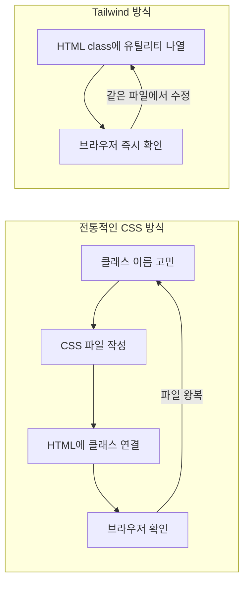

# Tailwind CSS: Utility-First로 디자인 생산성 극대화하기

전통적인 CSS 방식은 클래스 이름을 고민하고 파일 사이를 왔다 갔다 하는 시간이 많이 걸립니다. **Tailwind CSS**는 미리 정의된 유틸리티 클래스를 HTML에 바로 입혀, 디자인 시스템을 가장 빠르게 구축하게 해주는 프레임워크입니다.

---

## 1. Tailwind CSS의 핵심 철학 (Utility-First)

별도의 CSS 파일을 만들지 않고, HTML 태그의 `class` 속성에 스타일 관련 클래스를 직접 나열합니다.

*   **기존 방식:** `.btn-primary` 클래스를 만들고 CSS 파일에 10줄의 코드를 작성.
*   **Tailwind 방식:** `class="bg-blue-500 hover:bg-blue-700 text-white font-bold py-2 px-4 rounded"`

두 방식의 작업 흐름을 비교하면 차이가 더 명확해집니다.



---

## 2. 주요 장점

1.  **클래스명 고민 해결:** `wrapper`, `container-inner` 같은 이름을 지을 필요가 없습니다.
2.  **빠른 피드백:** 코드를 작성하는 즉시 브라우저에서 디자인 변화를 확인할 수 있습니다.
3.  **반응형 디자인:** `md:flex`, `lg:block` 처럼 접두사만으로 미디어 쿼리를 간단히 처리합니다.
4.  **일관된 디자인 시스템:** 정해진 수치(색상, 간격 등)만 사용하게 되므로 디자인이 통일됩니다.

---

## 3. 다크 모드와 인터랙션

테일윈드는 복잡한 기능을 클래스 하나로 처리합니다.

```html
<!-- 다크 모드 지원 예시 -->
<div class="bg-white dark:bg-slate-800 text-black dark:text-white">
  안녕하세요!
</div>

<!-- 호버 효과 -->
<button class="transition duration-300 transform hover:scale-110">
  확대되는 버튼
</button>
```

---

## 4. 왜 테일윈드일까?

처음에는 클래스가 너무 길어져서 가독성이 나빠 보일 수 있습니다. 하지만 **컴포넌트 중심 개발(React, Vue 등)** 환경에서는 스타일이 입혀진 태그 자체가 컴포넌트로 분리되므로, 실제 개발 생산성은 비약적으로 향상됩니다.

```jsx
// 긴 유틸리티 클래스도 컴포넌트로 한 번만 분리하면 재사용이 쉬워집니다.
function PrimaryButton({ children }) {
  return (
    <button className="bg-blue-500 hover:bg-blue-700 text-white font-bold py-2 px-4 rounded">
      {children}
    </button>
  );
}
```

---

## 5. 결론

Tailwind CSS는 개발자가 디자인에 대해 갖는 심리적 장벽을 낮춰줍니다. 특히 **Shadcn/ui** 같은 현대적인 컴포넌트 라이브러리들이 테일윈드를 기반으로 하고 있어, 2026년 현재 반드시 익혀야 할 도구입니다.
