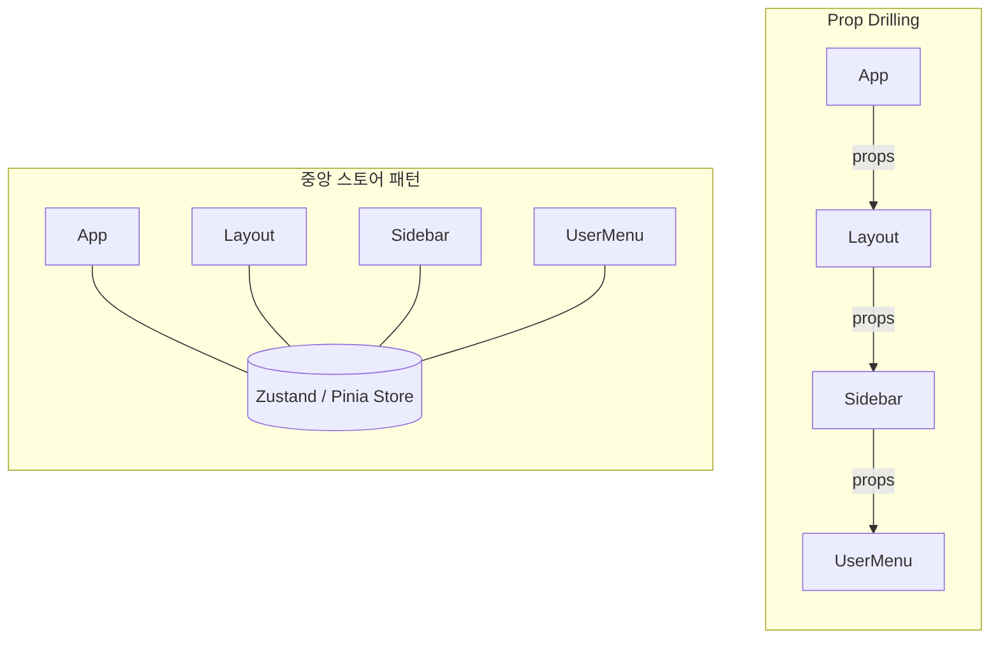
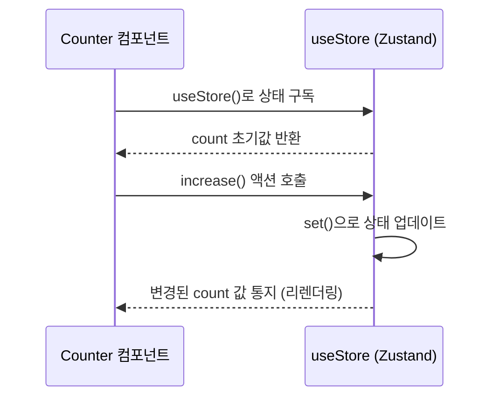

# 현대 프론트엔드 상태 관리: Zustand와 Pinia로 가볍게 시작하기


컴포넌트 간에 데이터를 공유하다 보면 'Prop Drilling'(여러 단계를 거쳐 Props를 전달) 문제에 직면하게 됩니다. 이를 해결하기 위해 Redux 같은 거대한 도구를 쓸 수도 있지만, 최근에는 더 단순하고 직관적인 **Zustand**와 **Pinia**가 대세로 자리 잡았습니다.

---

## 1. 상태 관리란 무엇인가?

애플리케이션에서 여러 컴포넌트가 함께 사용하는 공유 데이터(사용자 정보, 테마, 장바구니 등)를 효율적으로 관리하는 것을 말합니다. Prop Drilling 방식과 중앙 스토어 방식을 비교하면 아래와 같습니다.

**Prop Drilling(왼쪽) vs 중앙 스토어(오른쪽) 비교**


---

## 2. Zustand: React를 위한 작고 강력한 도구

Zustand는 독일어로 '상태'라는 뜻으로, 설정이 거의 없고 매우 가벼운 리액트용 상태 관리 라이브러리입니다.

### **Zustand 사용법 (예시)**
```javascript
import { create } from 'zustand';

// 스토어 생성
const useStore = create((set) => ({
  count: 0,
  increase: () => set((state) => ({ count: state.count + 1 })),
  removeAll: () => set({ count: 0 }),
}));

// 컴포넌트에서 사용
function Counter() {
  const { count, increase } = useStore();
  return (
    <div>
      <h1>{count}</h1>
      <button onClick={increase}>증가</button>
    </div>
  );
}
```

Zustand는 React Context나 Provider 트리 없이, 컴포넌트가 스토어를 직접 구독(subscribe)하는 방식으로 동작합니다. 상태가 바뀌면 해당 값을 구독 중인 컴포넌트만 리렌더링되므로 불필요한 렌더링을 줄일 수 있습니다.

**Zustand의 구독 기반 데이터 흐름**


---

## 3. Pinia: Vue의 공식 상태 관리 도구

Vue 3부터는 기존의 Vuex 대신 **Pinia**를 공식적으로 권장합니다. 타입스크립트 지원이 완벽하고 구조가 단순합니다.

### **Pinia 사용법 (예시)**
```javascript
import { defineStore } from 'pinia';

export const useCounterStore = defineStore('counter', {
  state: () => ({ count: 0 }),
  actions: {
    increment() {
      this.count++;
    },
  },
});
```

---

## 4. 왜 Redux가 아닌 이들을 선택할까?

1.  **러닝 커브:** Redux는 보일러플레이트 코드가 많고 복잡하지만, Zustand/Pinia는 몇 분 만에 배워서 바로 쓸 수 있습니다.
2.  **번들 크기:** 매우 가벼워 성능 최적화에 유리합니다.
3.  **유연성:** 특정 구조를 강제하지 않아 개발자 취향에 맞게 설계할 수 있습니다.

---

## 5. 결론

프로젝트가 엄청나게 크고 엄격한 규칙이 필요하다면 Redux가 여전히 유효할 수 있습니다. 하지만 대부분의 현대적 웹 서비스와 스타트업 프로젝트에서는 **Zustand(React)**나 **Pinia(Vue)**를 선택하는 것이 생산성 측면에서 훨씬 탁월한 선택입니다.
