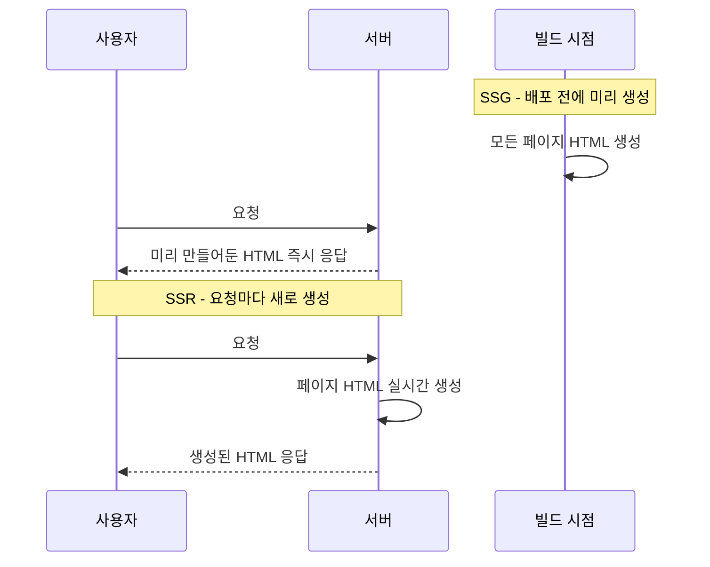
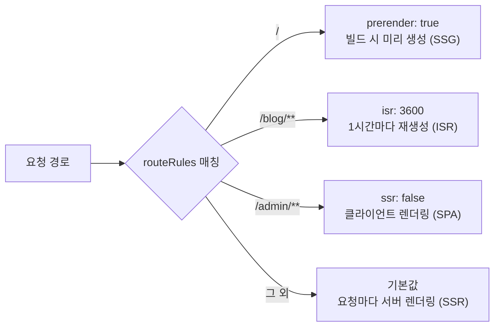

# Nuxt.js 렌더링 모드 완벽 정리: SSR부터 하이브리드까지


Nuxt.js의 가장 강력한 무기는 페이지별로 최적의 렌더링 방식을 선택할 수 있다는 것입니다. 각 모드의 특징과 2026년 표준인 하이브리드 렌더링에 대해 알아봅니다.

---

## 1. 주요 렌더링 모드

### **① Server-Side Rendering (SSR)**
*   **방식:** 요청마다 서버에서 페이지를 생성합니다.
*   **장점:** SEO에 최적화되어 있고, 항상 최신 데이터를 보여줍니다.
*   **단점:** 서버 부하가 발생할 수 있습니다.

### **② Static Site Generation (SSG)**
*   **방식:** 빌드 시점에 모든 페이지를 HTML로 미리 만듭니다.
*   **장점:** 압도적인 로딩 속도와 보안.
*   **단점:** 데이터가 변경되면 다시 빌드해야 합니다. (블로그에 적합)

SSR과 SSG는 HTML이 "언제" 만들어지는지가 가장 큰 차이입니다.



---

## 2. 하이브리드 렌더링 (Hybrid Rendering)

Nuxt 3에서는 `routeRules` 설정을 통해 한 앱 내에서 여러 방식을 섞어 쓸 수 있습니다.

```typescript
// nuxt.config.ts
export default defineNuxtConfig({
  routeRules: {
    '/': { prerender: true },         // 메인 페이지는 빌드 시 미리 생성 (SSG)
    '/blog/**': { isr: 3600 },        // 블로그는 1시간마다 갱신 (ISR)
    '/admin/**': { ssr: false },      // 관리자 페이지는 클라이언트에서만 (SPA)
  }
})
```

경로별로 서로 다른 렌더링 전략이 적용되는 흐름은 다음과 같습니다.



---

## 3. 상황별 권장 전략

1.  **실시간성 데이터가 중요한 대시보드:** **SSR**
2.  **콘텐츠 양이 많고 검색 노출이 중요한 블로그:** **ISR** (Incremental Static Regeneration)
3.  **검색 노출이 필요 없는 개인화된 앱:** **SPA** (Client-side Only)

---

## 4. 결론

Nuxt는 유연합니다. 전체 애플리케이션의 성격을 하나로 정의하기보다, 각 페이지의 목적에 맞는 렌더링 전략을 세워 성능과 SEO를 동시에 잡으세요!
