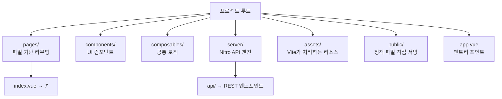
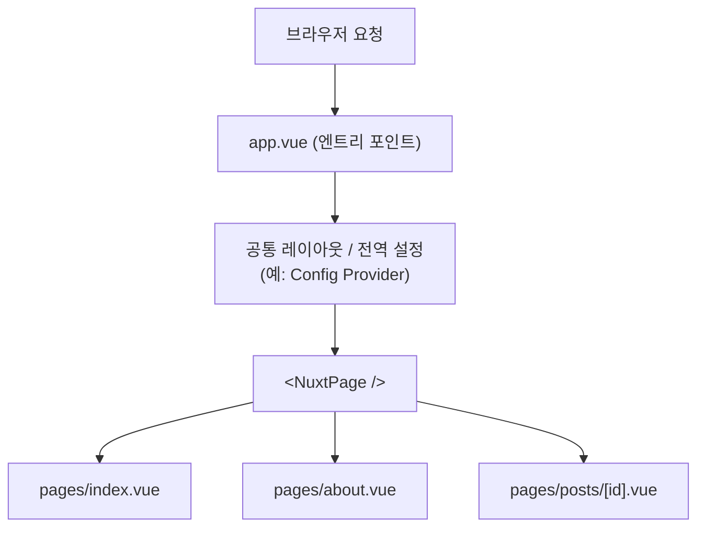

# Nuxt.js 핵심 개념: 자동 임포트와 디렉토리 구조 이해하기

Nuxt.js는 "설정보다 관습(Convention over Configuration)"을 중시하는 프레임워크입니다. 정해진 폴더 구조를 따르는 것만으로도 수많은 복잡한 설정을 자동으로 처리해 줍니다.

---

## 1. 마법 같은 자동 임포트 (Auto-imports)

Nuxt의 가장 큰 특징 중 하나는 `import`문을 생략할 수 있다는 점입니다.
*   **Components:** `components/` 폴더의 Vue 컴포넌트 자동 임포트.
*   **Composables:** `composables/` 폴더의 함수 자동 임포트.
*   **Vue & Nuxt API:** `ref`, `computed`, `useFetch` 등 필수 API 자동 임포트.

예를 들어 일반 Vue 프로젝트라면 아래처럼 매번 `import`를 작성해야 하지만,

```js
import { ref, computed } from 'vue'
import MyButton from '@/components/MyButton.vue'
```

Nuxt에서는 별도의 `import` 없이 바로 사용할 수 있습니다.

```vue
<script setup>
const count = ref(0)
const doubled = computed(() => count.value * 2)
</script>

<template>
  <MyButton @click="count++">클릭 수: {{ doubled }}</MyButton>
</template>
```

---

## 2. 필수 디렉토리 역할

| 폴더명 | 역할 |
| :--- | :--- |
| **`pages/`** | 파일 기반 라우팅을 담당합니다. `index.vue`는 `/` 경로가 됩니다. |
| **`components/`** | UI 컴포넌트들을 담습니다. 폴더 구조에 따라 이름이 결정됩니다. |
| **`composables/`** | 재사용 가능한 비즈니스 로직(공통 함수)을 둡니다. |
| **`server/`** | API 엔진(Nitro)이 동작하는 곳입니다. 백엔드 API 서버 역할을 수행합니다. |
| **`assets/`** | 빌드 도구(Vite)가 처리해야 하는 스타일, 이미지 파일들. |
| **`public/`** | 로봇 파일(robots.txt), 파비콘 등 정적 파일을 직접 서빙합니다. |

디렉토리 구조를 트리로 표현하면 다음과 같습니다.



---

## 3. App.vue vs Pages

*   **`app.vue`:** 애플리케이션의 엔트리 포인트(최상위)입니다. 모든 페이지에서 공통으로 보일 레이아웃이나 설정(Naive UI의 Config Provider 등)을 넣기에 적합합니다.
*   **`<NuxtPage />`:** `pages/` 폴더의 내용이 렌더링되는 위치를 지정하는 컴포넌트입니다.

`app.vue`와 `pages/`의 관계를 그림으로 보면 다음과 같습니다.



---

## 4. 결론

Nuxt는 정해진 위치에 파일을 두는 것만으로도 개발자가 비즈니스 로직에만 집중할 수 있게 해줍니다. 이 구조를 익히는 것이 Nuxt 마스터의 첫걸음입니다.
