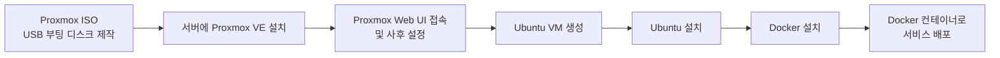
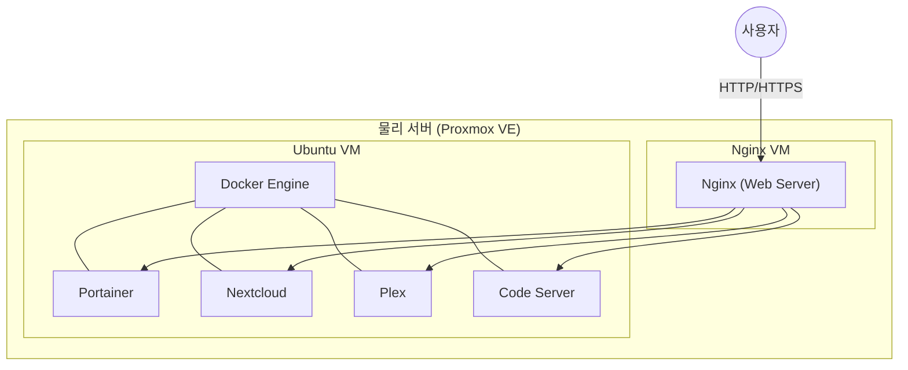

# Proxmox를 이용한 홈서버 만들기


유휴 PC에 Proxmox VE 를 설치하여 홈서버를 구축하고, 그 위에 Ubuntu VM 과 Docker 를 올려 여러 서비스를 운영하는 과정을 정리합니다.

전체 설치 흐름은 다음과 같습니다.



## 1. 운영체제
- Proxmox VE 8.2
- Ubuntu 22.04 LTS

## 2. Hardware

CPU: Intel i3-6100
RAM: 40GB
SSD: 256GB
HDD: 8TB

## 3. Software
Proxmox 에 Ubuntu VM 을 설치 한 후 Docker 를 설치 하여 다음 서비스를 운영합니다.
Nginx 는 별도 VM 을 추가로 구현 합니다.

    - Portainer: Docker Container 관리
    - Nginx: Web Server
    - Nextcloud: Cloud Storage
    - Plex: Media Server
    - Code Server: VSCode Server

전체 구조를 그림으로 정리하면 다음과 같습니다.



## 4. Proxmox 설치
- Proxmox VE 는 무료로 사용할 수 있는 가상화 솔루션 입니다.
- 가상 머신과 컨테이너를 웹 기반의 UI로 쉽게 관리할 수 있습니다.

> Proxmox VE 는 Debian 기반의 가상화 솔루션 입니다.

- 먼저 [Proxmox VE 8.2 ISO](https://www.proxmox.com/en/downloads/category/iso-images-pve)를 다운로드 받습니다.
- Proxmox ISO 를 USB 에 부팅 가능하도록 만듭니다.

> [Rufus](https://rufus.ie/ko/) 를 이용하여 USB 부팅 디스크를 만듭니다.

- Rufus 를 실행하고 Proxmox ISO 파일을 선택합니다.
- 부팅 디스크를 만들 USB 를 선택하고 시작 버튼을 누릅니다.
- 부팅 디스크가 완성되면 USB 를 서버에 연결하고 부팅 합니다.
- 서버를 부팅하면 USB 부팅이 시작됩니다.

> 부팅시 F2, F10, F12 등의 키를 눌러 BIOS 설정으로 진입합니다.

> 부팅 순서를 USB 로 변경하고 저장 후 재부팅 합니다.

- 부팅 후 Proxmox 설치를 시작합니다.
- 설치 방법은 다음과 같습니다.
  - 라이센스 동의
  - 디스크 선택
  - 키보드 레이아웃 및 지역 선택
  - 패스워드 설정
  - 설치 시작
  - 재부팅

## 5. Proxmox 실행
- 설치가 완료되면 Proxmox Web UI 에 접속하여 설정을 합니다.
- Proxmox Web UI 는 `https://<IP>:8006` 으로 접속합니다.
- 초기 계정은 `root` 이며 패스워드는 설치시 설정한 패스워드 입니다.


- Proxmox 설치가 완료되면 Ubuntu VM 을 생성하여 Docker 를 설치합니다.
- Ubuntu 를 사용할 것이므로, [Ubuntu 이미지를 다운로드](https://ubuntu.com/download/server) 합니다.
- Ubuntu VM 을 생성하는 방법은 다음과 같습니다.
- `Datacenter` -> `Node` -> `Create VM`
- `General` -> `Name`, `Resource Pool`, `Start at boot`, `OS Template`
- `OS` -> `CD/DVD` -> `ISO Image`, `Disk size`, `CPU`, `Memory`
- `Hard Disk` -> `Bus/Device`, `Disk size`, `Storage`
- `Network` -> `Bridge`, `Model`, `MAC address`
- `Confirm` -> `Finish`

<!-- TODO: 실제 스크린샷 추가 필요 (예: Proxmox VM 생성 마법사 화면) -->

- Ubuntu VM 이 생성되면 시작 버튼을 눌러 VM 을 시작합니다.
- VM 이 시작되면 `Console` 탭을 선택하여 VM 에 접속합니다.
- VM 에 접속 후 Ubuntu 를 설치합니다.
- Ubuntu 를 설치하는 방법은 다음과 같습니다.
- 언어 선택
- 키보드 선택
- 네트워크 설정
- 디스크 설정
- 사용자 설정
- 설치 시작
- 재부팅

<!-- TODO: 실제 스크린샷 추가 필요 (예: Ubuntu Server 설치 화면) -->

- Ubuntu 설치가 완료되면 Docker 를 설치합니다.
- Docker 를 설치하는 방법은 다음과 같습니다.
- `sudo apt update`
- `sudo apt install docker.io`
- `sudo systemctl start docker`
- `sudo systemctl enable docker`
- `docker --version`
- ## 6. 사후 설정 (Post-Installation)

### **No-Subscription 저장소 설정**
Proxmox는 유료 구독권이 없으면 업데이트 시 오류가 발생합니다. 무료 사용자를 위한 `pve-no-subscription` 저장소를 설정해야 합니다.

1. `/etc/apt/sources.list.d/pve-enterprise.list` 파일 내의 기업용 저장소를 주석 처리하거나 삭제합니다.
2. `/etc/apt/sources.list` 파일에 아래 내용을 추가합니다:
   ```bash
   deb http://download.proxmox.com/debian/pve bookworm pve-no-subscription
   ```
3. `apt update`를 실행하여 패키지 리스트를 갱신합니다.

### **구독 경고창 제거**
로그인 시마다 뜨는 'No Valid Subscription' 팝업을 제거하려면 스크립트를 사용하거나 수동으로 JS 파일을 수정할 수 있습니다. 예를 들어 아래와 같이 `proxmoxlib.js` 파일에서 경고창을 띄우는 조건문을 찾아 우회하는 방식이 흔히 사용됩니다.

```bash
sed -Ezi.bak "s/(Ext.Msg.show\(\{\s*title: gettext\('No valid sub)/void\(\{ \/\/\1/g" \
  /usr/share/javascript/proxmox-widget-toolkit/proxmoxlib.js
systemctl restart pveproxy.service
```

> Proxmox 업그레이드 시 해당 파일이 원래대로 복구되므로, 업그레이드 후에는 스크립트를 다시 실행해야 합니다.

<!-- TODO: 실제 스크린샷 추가 필요 (예: No Valid Subscription 경고창) -->

## 7. 마무리
이제 기본적인 Proxmox 설정이 완료되었습니다. 다음 글에서는 Nginx Proxy Manager를 설치하여 도메인을 연결하는 방법을 알아보겠습니다.
